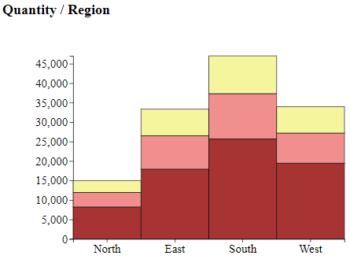
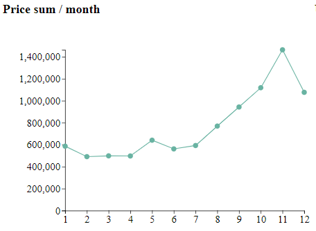
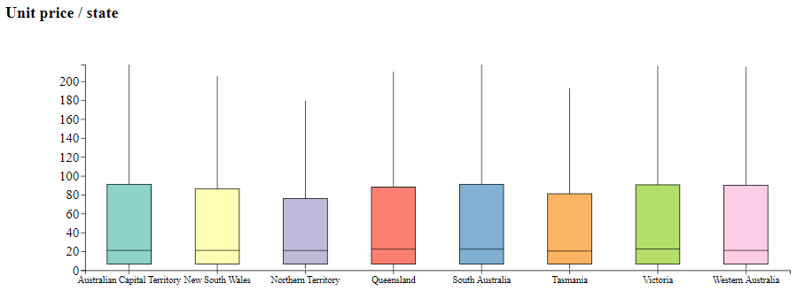

# BDV Lab Project 2019

Submission template for the Big Data Visualization (BDV) lab project at the University of Applied Sciences Upper Austria.

**Explanation:**
This `README.md` needs to be pushed to Github for each of the 3 delivery dates.
For every submission change/extend the corresponding sections by replacing the [TODO] markers.
*In order to meet the deadlines make sure you push everything to your Github repository.*

**Tip:** Make yourself familiar with [Markdown](https://github.com/adam-p/markdown-here/wiki/Markdown-Cheatsheet).

# Submission due on 30.10.2019

## General Information

**Project Name:**  Wine-Industry Project

**Group Members**

| Student ID    | First Name  | Last Name      |
| --------------|-------------|----------------|
| S1900454037   | Boris       | Melnikov       |
| S1900454036   | Margarita   | Kulachenko     |
| S1900595016   | Francesco   | Romeo          |

# Submission due on 06.11.2019

## Dataset

* What is the dataset about?
    - We've chosen a Wine Industry dataset. We have information about different wines, like the kind, the quality, the price
* Where did you get this dataset from (i.e., source of the dataset)?
    - The dataset comes from the Kaggle platform
      (https://www.kaggle.com/indranil9999/wine-industry)
* How was the dataset generated?
    - Salling company dataset
* What is dataset size in terms of nodes, items, rows, columns, ...?
    - It has 24 Features and 9367 samples
* How is the dataset structured?
    - It is a .xlsx table.

## User Tasks & Goals

* What are the user tasks?
    1) What is the most popular type of wine in each region?
    2) What is the total wine expenditure per each month?
    3) Do the states have similar habits in terms of wine prices?
* What would users like to see/get from the dataset?
    - How can the company maximize profit? Where and when can it sell a certain type of wine with a higher price?

# Submission due on 27.11.2019

## Proposed Dashboard Solution

* Which type of visualizations did you use?
    1) Stacked column chart 
    2) Line plot
    3) Box plot
* Explain why you chose these visualizations?
    1) The stacked column chart shows preferences per each region
    2) The line plot helps the user to understand the consumers' habits trends
    3) The box plot represents price distribution of ordered wine in a certain state
* Add sketches or images if possible
1) Stacked column chart
# 
2) Line plot
# 
3) Box plot
# 

# Submission due on &lt;TBD&gt;

## Implementation Details

* How did you implement the dashboard?
    - A structure of code is the same as proposed in the tutorial (https://github.com/thinkh/d3tutorial). There are 3 charts and one selector. Click on each chart change filtering data.
* Which external libraries and/or resources did you use?
    - We used only d3.js
* Additional information about the implementation
    - On the first chart "Quantity / Region", it is possible to choose segment (the type of wine - white, rose/sparkling or red) by clicking on column area (new filter is applied to data). Colors are intuitively clear. The second click on columns removes segment filter.
    - On the second chart "Price sum / month", you can choose a particular month by clicking on a node (point). With a second click, you can either choose another month (by clicking on another node) or cancel month filter (by clicking on the same node). Note: please check year selection - if "all" you can see summed price among all years. Instead, selecting a specific year is it possible seeing its trend. 
    - On the third chart "Unit price / State", it is possible to choose a specific state by clicking on the corresponding box. A second click on the box removes state filter.

## Limitations

* What are the limitations of your solution?
    - Multiple choices on the same filter is not allowed 
        - you can select all years or just one. The same limitation for other filters.

* Is there anything that a user could not achieve from the given user tasks? Why? What is missing and how must the prototype be improved?
    - The user can answer to all predefined questions. However, our prototype could be improved in order to make more comparisons among the same features, giving the possibility of multiple-choice selection on the same filter

## Findings and Insights

* How does the solution enable users to answer the tasks?#
    - Corresponding plots show the required information:
        - The stacked column chart shows wine consumption in each region 
        - The line chart shows the sum of order costs in each month
        - Box plot represents unit price distribution according to states
    - Filters by year, month, segment and state help user to reach more detailed visualization

* What are the findings and insights from the dataset?
    - The most popular type of wine in all regions is red wine. The south region consumes more wine in comparison with other regions.
    - People spend more money on wine in the last quarter of the year. The first quarter is the worst for a selling campaign.
    - States have quate similar habits in term of wine price. Northern Territory and Tasmania prefer a bit cheaper wine.

## Conclusion

* What is your conclusion?

    - D3.js is very flexible for visualization. It could support any kind of customized plots. At the start, it was very hard to learn that library. The examples we found for selected plot types were static in most cases, and we spend much time to transform static to interactive. But in the end, we have got nice visualization with animations. Moreover, the acquired knowledge will help us for future projects.
